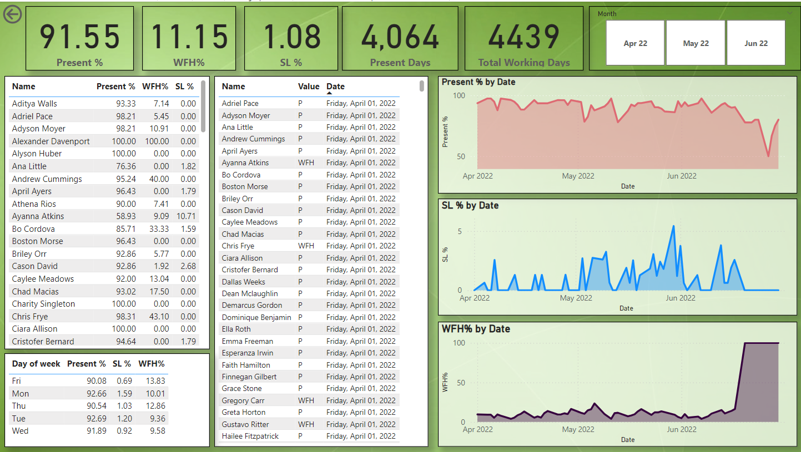

# HR-Analytics-PowerBI-Dashboard

## Overview
This Power BI dashboard provides a comprehensive view of employee attendance data, offering insights into the overall presence, work from home (WFH) trends, and sick leave (SL) statistics. The dashboard visualizes data across various dimensions including individual employee performance, daily trends, and monthly summaries.

## Visualizations
**Key Metrics**
1. Present %: The percentage of days employees are present at work.
2. WFH %: The percentage of days employees work from home.
3. SL %: The percentage of days employees are on sick leave.
4. Present Days: The total number of days employees are present.
5. Total Working Days: The total number of working days available.

**Detailed Tables**
1. Individual Performance Table: Lists employees with their respective Present %, WFH %, and SL %.
2. Day of the Week Table: Shows attendance metrics segmented by day of the week.

**Trend Graphs**
1. Present % by Date: Line chart showing the trend of Present % over time.
2. SL % by Date: Line chart depicting the trend of SL % over time.
3. WFH % by Date: Line chart illustrating the trend of WFH % over time.

**Usage Instructions**
- Filter by Month: Use the month slicer to filter the data by specific months (e.g., April 2022, May 2022, June 2022).
- Analyze Individual Performance: Review the Individual Performance Table to assess attendance metrics for each employee.
- Evaluate Daily Trends: Use the trend graphs to monitor how attendance metrics change over time.
- Day of the Week Analysis: Examine the Day of the Week Table to understand attendance patterns on different days.

## Technical Details

**Present % Calculation:**

Present % = DIVIDE([Present Days], 'Measure Table'[Total Working Days], 0) * 100

**WFH % Calculation:**

WFH % = DIVIDE([WFH Days], 'Measure Table'[Total Working Days], 0) * 100

**SL % Calculation:**

SL % = DIVIDE([SL Days], 'Measure Table'[Total Working Days], 0) * 100
